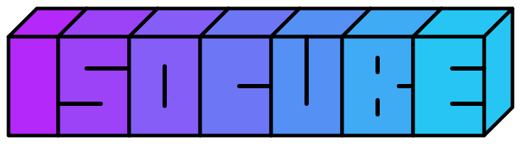
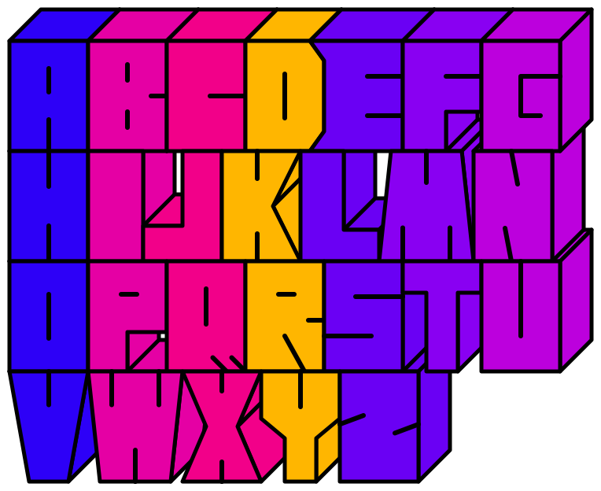

# isocube

[](https://www.npmjs.com/package/isocube)

Generate colorful block-letter logos as transparent SVGs. No API key, external fonts, or runtime dependencies required.



## Usage

One row, random RGB color for each character. Colors vary on each run; the image below is one example.

```sh
npx isocube --text HELLO --out output/hello.svg
```


Reverse the text: HELLO becomes OLLEH.

```sh
npx isocube --text HELLO --reverse --out output/reverse.svg
```

Two rows: hello / world.

```sh
npx isocube --text helloworld --break-at 5 \
  --colors '#2D00F7,#E500A4,#F20089,#FFB600,#6A00F4,#8900F2,#BC00DD' \
  --out output/hello-world.svg
```


Three rows: ABC / DEF / GHI.

```sh
npx isocube --text ABCDEFGHI --break-at 3,6 \
  --colors 'rgb(45,0,247),#E500A4' --out output/repeat-color.svg
```


All 26 letters: four rows of A–Z.

```sh
npx isocube --text ABCDEFGHIJKLMNOPQRSTUVWXYZ --break-at 7,14,21 \
  --colors '#2D00F7,#E500A4,#F20089,#FFB600,#6A00F4,#8900F2,#BC00DD' \
  --out output/alphabet.svg
```



| Option       | Description                                                                                                                                                            |
| ------------ | ---------------------------------------------------------------------------------------------------------------------------------------------------------------------- |
| `--text`     | Required. 1–256 ASCII letters, digits, or actual newlines. Lowercase becomes uppercase. No spaces or other characters.                                                 |
| `--reverse`  | Reverse the entire input, including newlines, before applying `--break-at`. Colors follow the resulting character order. Defaults to off.                              |
| `--break-at` | Optional ascending cumulative character positions, e.g. `4` or `3,6`. Cannot be combined with embedded newlines.                                                       |
| `--colors`   | Optional comma-separated `#RGB`, `#RRGGBB`, or `rgb(r,g,b)` colors. A short palette repeats across rows. Defaults to independent random RGB values for each character. |
| `--out`      | SVG output path. Default: `output/logo.svg`. Existing files are overwritten.                                                                                           |
| `--force`    | Accepted for compatibility. Existing files are overwritten by default.                                                                                                 |
| `--help`     | Show usage.                                                                                                                                                            |

## JavaScript API

```js
import { generateLogo } from 'isocube';

const { svg, lines, colors } = generateLogo({
  text: 'SAMPLE',
  breakAt: [4],
  colors: ['#2D00F7', '#E500A4'],
});
```

TypeScript declarations are included.

Pass `reverse: true` to reverse the input before applying `breakAt`, just like the CLI's `--reverse` option.

## License

MIT
