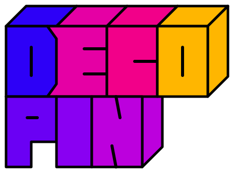

# block-string-logo

Generate colorful block-letter logos as transparent SVGs. No API key, external fonts, or runtime dependencies required. Supports Node.js 22 or later.



## Usage

```sh
npx block-string-logo --text DECOPIN --break-at 4 \
  --colors '#2D00F7,#E500A4,#F20089,#FFB600,#6A00F4,#8900F2,#BC00DD' \
  --out output/decopin.svg

# One row, random RGB color for each character
npx block-string-logo --text HELLO --out output/hello.svg

# Three rows: ABC / DEF / GHI
npx block-string-logo --text ABCDEFGHI --break-at 3,6 \
  --colors 'rgb(45,0,247),#E500A4' --out output/example.svg
```

| Option       | Description                                                                                                                                                            |
| ------------ | ---------------------------------------------------------------------------------------------------------------------------------------------------------------------- |
| `--text`     | Required. 1–256 ASCII letters, digits, or actual newlines. Lowercase becomes uppercase. No spaces or other characters.                                                 |
| `--break-at` | Optional ascending cumulative character positions, e.g. `4` or `3,6`. Cannot be combined with embedded newlines.                                                       |
| `--colors`   | Optional comma-separated `#RGB`, `#RRGGBB`, or `rgb(r,g,b)` colors. A short palette repeats across rows. Defaults to independent random RGB values for each character. |
| `--out`      | SVG output path. Default: `output/logo.svg`.                                                                                                                           |
| `--force`    | Replace an existing output file. Without this option, overwrites fail.                                                                                                 |
| `--help`     | Show usage.                                                                                                                                                            |

Rows are left-aligned and touch. Only the first row has top faces. The letter I has no interior stroke. The background is transparent and the black outlines remain opaque. Random colors are printed so you can reuse them with `--colors`.

The lettering is a geometric interpretation of the original DECOPIN logo, not a pixel-exact copy. Output is SVG; PNG and WebP conversion are not included.

## JavaScript API

```js
import { generateLogo } from 'block-string-logo';

const { svg, lines, colors } = generateLogo({
  text: 'DECOPIN',
  breakAt: [4],
  colors: ['#2D00F7', '#E500A4'],
});
```

TypeScript declarations are included.

## Development

```sh
npm ci
npm test
npm run typecheck
npm pack --dry-run
```

## Release

1. Update `version` in `package.json` and the lockfile.
2. Run `npm test` and inspect `npm pack --dry-run`.
3. Sign in with `npm login` and publish with `npm publish --access public`.

Published versions cannot be overwritten. The initial version is `0.1.0`.

## License

MIT
