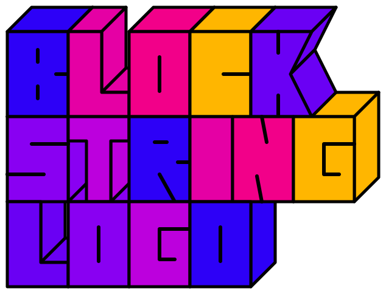
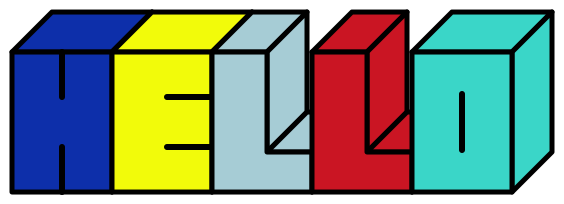
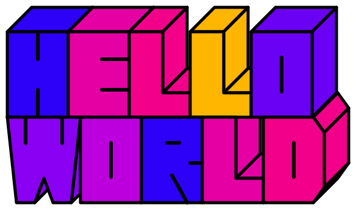
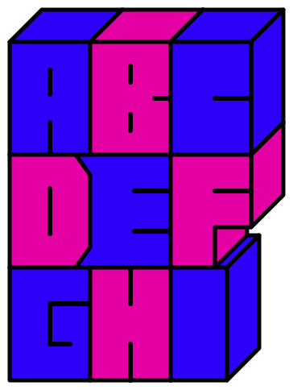

# block-string-logo

Generate colorful block-letter logos as transparent SVGs. No API key, external fonts, or runtime dependencies required. Supports Node.js 22 or later.



## Usage

One row, random RGB color for each character. Colors vary on each run; the image below is one example.

```sh
npx block-string-logo --text HELLO --out output/hello.svg
```



Two rows: hello / world.

```sh
npx block-string-logo --text helloworld --break-at 5 \
  --colors '#2D00F7,#E500A4,#F20089,#FFB600,#6A00F4,#8900F2,#BC00DD' \
  --out output/hello-world.svg
```



Three rows: ABC / DEF / GHI.

```sh
npx block-string-logo --text ABCDEFGHI --break-at 3,6 \
  --colors 'rgb(45,0,247),#E500A4' --out output/repeat-color.svg
```



| Option       | Description                                                                                                                                                            |
| ------------ | ---------------------------------------------------------------------------------------------------------------------------------------------------------------------- |
| `--text`     | Required. 1–256 ASCII letters, digits, or actual newlines. Lowercase becomes uppercase. No spaces or other characters.                                                 |
| `--break-at` | Optional ascending cumulative character positions, e.g. `4` or `3,6`. Cannot be combined with embedded newlines.                                                       |
| `--colors`   | Optional comma-separated `#RGB`, `#RRGGBB`, or `rgb(r,g,b)` colors. A short palette repeats across rows. Defaults to independent random RGB values for each character. |
| `--out`      | SVG output path. Default: `output/logo.svg`. Existing files are overwritten.                                                                                                                           |
| `--force`    | Accepted for compatibility. Existing files are overwritten by default.                                                                                                 |
| `--help`     | Show usage.                                                                                                                                                            |

Rows are left-aligned and touch. Top and side faces are visible wherever neighboring letters leave an opening, including overhangs on lower rows. The letter I has no interior stroke. The background is transparent and the black outlines remain opaque. Random colors are printed so you can reuse them with `--colors`.

The lettering is a geometric interpretation of the original SAMPLE logo, not a pixel-exact copy. Output is SVG; PNG and WebP conversion are not included.

## JavaScript API

```js
import { generateLogo } from 'block-string-logo';

const { svg, lines, colors } = generateLogo({
  text: 'SAMPLE',
  breakAt: [4],
  colors: ['#2D00F7', '#E500A4'],
});
```

TypeScript declarations are included.

## Development

```sh
bun install
```

Run the tests:

```sh
bun test
```

Check types:

```sh
bun run typecheck
```

Preview package contents:

```sh
bun pm pack --dry-run
```

## License

MIT
